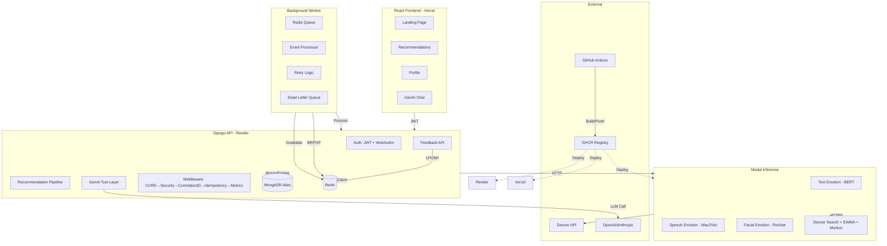

# VibeStream Architecture Diagram

**Generated:** 2026-09-05  
**Version:** 1.0.0 (Production)

---

## System Overview

```
┌─────────────────────────────────────────────────────────────────────────────────────┐
│                              REACT FRONTEND (Vercel)                                │
│  ┌──────────────┐  ┌────────────────┐  ┌────────────┐  ┌────────────────────────┐  │
│  │ Landing Page │  │ Recommendations│  │ Profile    │  │ GenAI Chat Assistant   │  │
│  │ /            │  │ /recommendations│ │ /profile   │  │ (Natural Language)     │  │
│  └──────┬───────┘  └───────┬────────┘  └─────┬──────┘  └────────────┬───────────┘  │
└─────────┼──────────────────┼─────────────────┼──────────────────────┼──────────────┘
          │                  │                 │                      │
          │ JWT (Authorization)              │ JWT                  │ JWT
          ▼                  ▼                 ▼                      ▼
┌─────────────────────────────────────────────────────────────────────────────────────┐
│                           DJANGO API / DRF (Render)                                 │
│  ┌──────────────┐  ┌──────────────────┐  ┌────────────┐  ┌──────────────────────┐   │
│  │ Auth         │  │ Recommendation   │  │ Feedback   │  │ GenAI Tool Layer     │   │
│  │ (JWT,        │  │ Pipeline         │  │ (Async     │  │ (5 Validated Tools)  │   │
│  │  WebAuthn)   │  │                  │  │  Events)   │  │                      │   │
│  └──────────────┘  └────────┬─────────┘  └─────┬──────┘  └───────────┬──────────┘   │
│                             │                    │                     │             │
│  Middleware Chain:          │                    │                     │             │
│  CORS → Security →          │                    │                     │             │
│  CorrelationID →            │                    │                     │             │
│  Idempotency → Metrics      │                    │                     │             │
│                             ▼                    ▼                     ▼             │
│  ┌──────────────────────────────────────────────────────────────────────────────┐   │
│  │                    DJANGO ORM / MONGOENGINE (MongoDB Atlas)                  │   │
│  │  ┌──────────┐  ┌───────────────┐  ┌───────────────┐  ┌─────────────────┐    │   │
│  │  │ User     │  │ UserProfile   │  │ Mood/Track    │  │ Metrics         │    │   │
│  │  │ (Auth)   │  │ (Preferences, │  │ Feedback      │  │ (Time-Series)   │    │   │
│  │  │          │  │  Bandit, Cal) │  │ (Time-Series) │  │                 │    │   │
│  │  └──────────┘  └───────────────┘  └───────────────┘  └─────────────────┘    │   │
│  └──────────────────────────────────────────────────────────────────────────────┘   │
└─────────────────────────────────────────────────────────────────────────────────────┘
          │                    │                      │
          │ Modal HTTP         │ MongoDB              │ Redis
          ▼                    ▼                      ▼
┌─────────────────────┐ ┌───────────────┐ ┌──────────────────────────────────┐
│   MODAL INFERENCE   │ │   MONGODB     │ │           REDIS                  │
│   (FastAPI on GPU)  │ │   (Atlas)     │ │                                  │
│                     │ │               │ │  ┌────────────────────────────┐  │
│  ┌────────────────┐ │ │  • User       │ │  │ Recommendation Cache       │  │
│  │ Text Emotion   │ │ │  • UserProfile│ │  │  (rec:*, 10min TTL)        │  │
│  │  (BERT)        │ │ │  • Feedback   │ │  │  • Idempotency Keys        │  │
│  │                │ │ │    (TS)       │ │  │  (idem:*, 24hr TTL)        │  │
│  │  ┌──────────┐  │ │  • Metrics    │ │  │  • Rate Limiting           │  │
│  │  │ Speech   │  │ │    (TS)       │ │  │    (SlidingWindowLimiter)  │  │
│  │  │ Emotion  │  │ │               │ │  │  • Event Queue             │  │
│  │  │ (Wav2Vec)│  │ │               │ │  │    (vibestream:events:     │  │
│  │  └──────────┘  │ │               │ │  │     queue, BRPOP 5s)       │  │
│  │                │ │               │ │  │  • Dead Letter Queue       │  │
│  │  ┌──────────┐  │ │               │ │  │    (vibestream:events:     │  │
│  │  │ Facial   │  │ │               │ │  │     dead_letter)           │  │
│  │  │ Emotion  │  │ │               │ │  └────────────────────────────┘  │
│  │  │ (ResNet) │  │ │               │ └──────────────────────────────────┘
│  │  └──────────┘  │ │               │
│  │                │ │               │
│  │  ┌──────────┐  │ │               │
│  │  │ Deezer   │  │ │               │
│  │  │ Search   │  │ │               │
│  │  │ + EWMA   │  │ │               │
│  │  │ + Markov │  │ │               │
│  │  └──────────┘  │ │               │
│  └────────────────┘ └───────────────┘
└─────────────────────────────────────────────────────────────────────────────────────┘
          │
          ▼
┌─────────────────────────────────────────────────────────────────────────────────────┐
│                        EXTERNAL SERVICES                                             │
│  ┌─────────────┐  ┌─────────────┐  ┌─────────────┐  ┌─────────────┐                │
│  │   DEEZER    │  │   LLM       │  │  GITHUB     │  │  DOCKER     │                │
│  │  (Public    │  │  (OpenAI/   │  │  ACTIONS    │  │  HUB (GHCR) │                │
│  │   API)      │  │  Anthropic) │  │  (CI/CD)    │  │  (Registry) │                │
│  └─────────────┘  └─────────────┘  └─────────────┘  └─────────────┘                │
└─────────────────────────────────────────────────────────────────────────────────────┘

                        ┌─────────────────────────────────────┐
                        │      BACKGROUND WORKER PROCESS      │
                        │  (python -m api.worker)             │
                        │                                     │
                        │  ┌─────────────────────────────┐    │
                        │  │ Redis BRPOP (5s timeout)    │    │
                        │  │        │                     │    │
                        │  │  ┌─────┴─────┐              │    │
                        │  │  │ Processor  │              │    │
                        │  │  │  • Feedback│              │    │
                        │  │  │    Track   │              │    │
                        │  │  │  • Feedback│              │    │
                        │  │  │    Mood    │              │    │
                        │  │  │  • Cache   │              │    │
                        │  │  │    Invalidate│            │    │
                        │  │  └─────┬─────┘              │    │
                        │  │       │                    │    │
                        │  │  ┌────┴────┐               │    │
                        │  │  │ Retry   │  (max 3,       │    │
                        │  │  │ Logic   │   exp backoff) │    │
                        │  │  └────┬────┘               │    │
                        │  │       │                    │    │
                        │  │  ┌────┴────┐               │    │
                        │  │  │ Dead    │  (max retries) │    │
                        │  │  │ Letter  │                │    │
                        │  │  └─────────┘               │    │
                        │  └─────────────────────────────┘    │
                        └─────────────────────────────────────┘
```

---

## Data Flow Details

### 1. Recommendation Request Flow
```
User → Frontend → Django API → Recommendation Pipeline
                                    │
                                    ▼
                            ┌─────────────────┐
                            │ Candidate Gen   │ → Modal/Deezer (60 tracks)
                            └────────┬────────┘
                                     ▼
                            ┌─────────────────┐
                            │ Base Ranking    │ → Normalize scores [0,1]
                            └────────┬────────┘
                                     ▼
                            ┌─────────────────┐
                            │ Personalization │ → Explicit prefs (if warm)
                            └────────┬────────┘
                                     ▼
                            ┌─────────────────┐
                            │ Thompson Sampling│ → Beta-Bernoulli rerank
                            └────────┬────────┘
                                     ▼
                            ┌─────────────────┐
                            │ Diversity (MMR) │ → λ=0.3, artist/era
                            └────────┬────────┘
                                     ▼
                            ┌─────────────────┐
                            │ Explanations    │ → Signal-based only
                            └────────┬────────┘
                                     ▼
                            ┌─────────────────┐
                            │ Cache (10min)   │ → Redis rec:*, SCAN invalidation
                            └────────┬────────┘
                                     ▼
                            Response (Top 20)
```

### 2. Feedback Processing Flow
```
User → POST /feedback/ (Idempotency-Key)
            │
            ▼
    Validate + Create Event
            │
            ▼
    Redis LPUSH → vibestream:events:queue
            │
            ▼
    Return 202 Accepted (event_id)
            │
            ▼
    ────────────────────────────────────────
    BACKGROUND WORKER (separate process)
    ────────────────────────────────────────
            │
            ▼
    Redis BRPOP (5s timeout)
            │
            ▼
    ┌────────────────────────────────────┐
    │ Process Event                      │
    │  • FeedbackTrack:                  │
    │    - Update bandit posterior       │
    │    - Update preferences            │
    │    - Persist to MongoDB (TS)       │
    │    - Invalidate Redis cache        │
    │  • FeedbackMood:                   │
    │    - Update calibration map        │
    │    - Persist to MongoDB (TS)       │
    │    - Invalidate Redis cache        │
    └────────┬───────────────────────────┘
             │
             ▼
    Success → Ack (remove from queue)
    Failure → Retry (max 3, exp backoff)
    Max Retries → Dead Letter Queue
```

### 3. GenAI Tool Calling Flow
```
User Message
    │
    ▼
GenAIAssistant.process_message()
    │
    ▼
IntentExtractor.extract()
    │
    ├── build_prompt() with history + tool schemas
    ├── LLM.complete_json() → raw intent
    └── IntentSchema.validate() → Pydantic model
    │
    ▼
ToolCall(name=intent.intent, arguments=...)
    │
    ▼
ToolRegistry.execute_tool()
    │
    ├── _check_auth() → requires JWT
    ├── _make_request() → Django API (Bearer token)
    └── ToolResult(success, data, error)
    │
    ▼
Assistant._format_response() → Natural language
    │
    ▼
User Response
```

---

## Component Responsibilities

| Component | Technology | Responsibility |
|-----------|------------|----------------|
| **Frontend** | React 18, Vite, Vercel | UI, GenAI chat, auth flow |
| **Django API** | DRF, Render | Auth, orchestration, persistence |
| **Modal Inference** | FastAPI, Modal, GPU | Text/Speech/Facial emotion + Deezer recs |
| **MongoDB Atlas** | mongoengine | User, Profile, Feedback (TS), Metrics (TS) |
| **Redis** | fakeredis (test) / Upstash (prod) | Cache, Idempotency, Queue, Rate Limit |
| **Background Worker** | Python, Redis | Async feedback processing |
| **GenAI Assistant** | Python, Pydantic | LLM → Structured Intent → Tools |
| **Deezer API** | Public REST | Track search, metadata, previews |
| **LLM Providers** | OpenAI/Anthropic | Intent extraction only |
| **Observability** | Structlog, MongoDB TS | Logs, metrics, traces |
| **CI/CD** | GitHub Actions | Format, test, build, deploy |
| **Containers** | Docker, GHCR | Multi-arch images |
| **Infrastructure** | Terraform, Helm, K8s | Reference implementations |

---

## Security Boundaries

```
┌─────────────────────────────────────────────────────────────┐
│                    TRUST BOUNDARIES                          │
├─────────────────────────────────────────────────────────────┤
│                                                              │
│  ┌─────────────┐    ┌─────────────┐    ┌─────────────┐     │
│  │   PUBLIC    │    │  AUTHENTICATED   │  │   INTERNAL    │     │
│  │   INTERNET  │───▶│     USERS       │───▶│   SERVICES    │     │
│  └─────────────┘    └──────────────────┘    └─────────────┘     │
│        │                   │                    │                │
│        ▼                   ▼                    ▼                │
│  • /health           • /music_rec      • Modal Inference      │
│  • /text_emotion     • /feedback       • MongoDB Atlas        │
│  • /music_rec        • /profile        • Redis (internal)     │
│  (anon allowed)      • /genai/*        • Background Worker    │
│                      (JWT required)   • Background Tasks     │
│                                              │                │
│  ┌─────────────────────────────────────────────────────────┐  │
│  │                  GEN AI BOUNDARY                         │  │
│  │  LLM ──▶ Structured Intent ──▶ Validated Tool ──▶ API   │  │
│  │       │              │              │          │          │  │
│  │       │              │              │          ▼          │  │
│  │       │              │              │   Django API        │  │
│  │       │              │              │        │            │  │
│  │       │              │              │        ▼            │  │
│  │       │              │              │  Recommendation     │  │
│  │       │              │              │   Engine            │  │
│  │       │              │              │        │            │  │
│  │       │              │              │        ▼            │  │
│  │       │              │              │   Response          │  │
│  │       └──────────────┴──────────────┴────────────────────┘  │
│  │  NEVER: LLM→DB, LLM→Redis, LLM→RecEngine, Tool→Raw SQL      │  │
│  └─────────────────────────────────────────────────────────────┘  │
└─────────────────────────────────────────────────────────────┘
```

---

## Deployment Targets

| Component | Platform | Config | Scaling |
|-----------|----------|--------|---------|
| Frontend | Vercel | `vercel.json` | Automatic (Edge) |
| Backend API | Render | `Dockerfile`, `render.yaml` | Auto (CPU) |
| ML Inference | Modal | `modal_app.py` | GPU, Scale-to-zero |
| Background Worker | Render | `worker.py` entrypoint | Manual (1-3 replicas) |
| Redis | Upstash | `REDIS_URL` env | Serverless |
| MongoDB | Atlas | `MONGO_DB_URI` env | Managed |
| Containers | GHCR | `docker-compose.yml` | Multi-arch |

---

## Mermaid Source (for rendering)



---

## File Locations

| Diagram | File |
|---------|------|
| This document | `ARCHITECTURE_DIAGRAM.md` |
| Mermaid source | Above (copy to mermaid.live) |
| System overview | `FINAL_ARCHITECTURE_AUDIT.md` |
| Decision records | `KAFKA_DECISION.md`, `KUBERNETES_DECISION.md` |