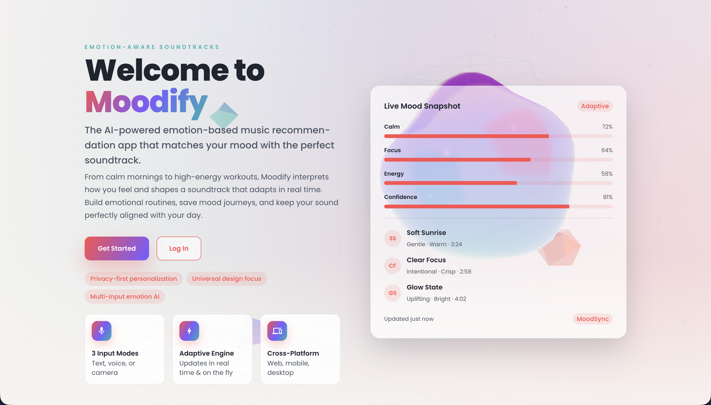
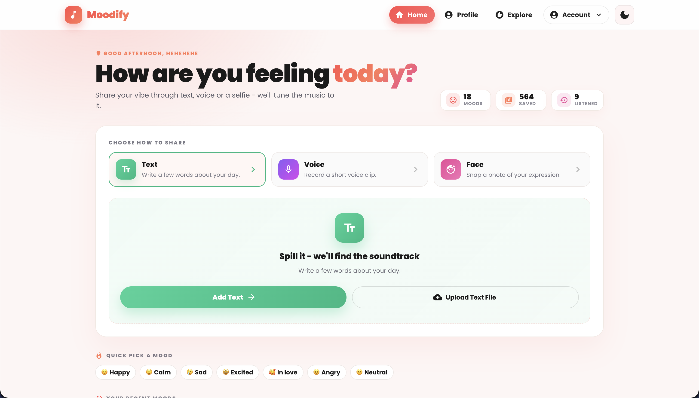
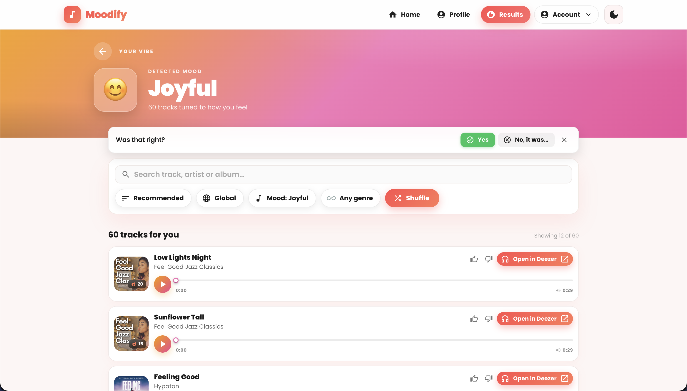
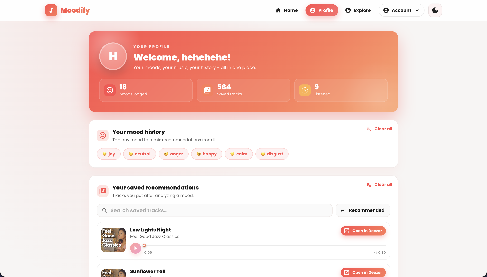

# VibeStream

**Adaptive music recommendation platform that learns from your mood and feedback.**

[](https://python.org)
[](https://djangoproject.com)
[](https://react.dev)
[](https://fastapi.tiangolo.com)
[](https://modal.com)
[](https://mongodb.com/atlas)
[](https://developers.deezer.com)
[](https://github.com/JainMehul05/VibeStream/actions)
[]()

---

## Overview

**VibeStream** is an adaptive music recommendation platform that uses multimodal emotion detection (text, speech, facial expressions) to generate personalized music recommendations from Deezer. The system learns from user feedback (👍/👎/Open in Deezer) to continuously improve recommendations through online reinforcement learning.

**Key differentiator:** Emotion is a *contextual signal* for recommendation, not the entire user profile. The system combines rule-based recommendation (EWMA + Markov mood blending) with online personalization (Thompson Sampling contextual bandit + mood calibration) that adapts to each user's taste over time.

> **Attribution:** VibeStream is a substantially modified and extended version of the open-source [Moodify](https://github.com/hoangsonww/Moodify-Emotion-Music-App) project by Son Nguyen (@hoangsonww). The original project implemented the core emotion detection and recommendation pipeline. VibeStream adds API versioning, backend restructuring, Thompson Sampling personalization, mood calibration, WebAuthn passkeys, comprehensive test coverage, and production-grade infrastructure.

---

## Why VibeStream?

Traditional music recommenders rely on collaborative filtering or static user profiles. VibeStream treats **emotion as a contextual signal** — a snapshot of how you feel *right now* — and combines it with:

- **Your mood history** (EWMA + Markov blending for recurring moods)
- **Your explicit feedback** (Thompson Sampling bandit re-ranking)
- **Your implicit feedback** (Open in Deezer = soft positive signal)
- **Your corrections** (Mood calibration map for systematic model errors)

The result: recommendations that adapt to *how you feel right now* while learning your long-term taste.

---

## Key Features

### 🎭 Multimodal Emotion Detection
| Modality | Model | Labels | Deployment |
|----------|-------|--------|------------|
| **Text** | Fine-tuned BERT (Transformers) | sadness, joy, love, anger, fear, neutral | Modal (BERT) |
| **Speech** | SVC + MFCC (scikit-learn) | calm, happy, sad, angry, fearful, disgust, surprised, neutral | Modal (librosa + SVC) |
| **Facial** | FER + MTCNN (Keras/TF) | angry, disgust, fear, happy, sad, surprise, neutral | Modal (FER + MTCNN) |

- Text: Django proxy → Modal (service token)
- Speech/Facial: Direct browser → Modal (user JWT, multipart ≤12 MB)
- Fallback: Neutral emotion + curated tracks on any model failure (never 500)

### 🎵 Adaptive Recommendations
- **Source:** Deezer Search API (keyless, public)
- **Base ranking:** EWMA (λ=0.85) + First-order Markov (boost=0.6) on mood history
- **Recurring mood blend:** Interleaves tracks for recurring mood (ratio 1:1 to 1:5)
- **Quality ranking:** Curated position + Deezer popularity (weight=0.2)
- **Curated fallback:** 14 popular tracks if Deezer fails

### 🧠 Personalization Architecture (Two-Layer RL)

#### Layer 1: Mood Calibration (L1)
- Per-user map: `{predicted_emotion: {actual_emotion: count}}`
- Threshold: ≥3 same-direction corrections → rewrite prediction
- Applied in Django after Modal returns (anonymous users unaffected)
- Persisted in `UserProfile.mood_calibration` (MongoDB)

#### Layer 2: Thompson Sampling Bandit (L2)
- **Algorithm:** Beta-Bernoulli posterior per feature axis (22 dimensions)
- **Features (22-d fixed):** Emotion (6) + Decade (7) + Duration (4) + Popularity quintile (5)
- **Rewards:** Like=+1.0α, Unlike=+1.0β, Open in Deezer=+0.5α
- **Cold-start:** Identity when `< 20` events (never injects/drops tracks)
- **Set-vote semantics:** Like↔Unlike switch reverts prior vote; Clear reverts to zero
- **Revert uses exact feature vector** from original vote (precise cancellation)
- Applied in Django after Modal returns; cold users see base order

### 🔐 Authentication & Security
| Mechanism | Implementation |
|-----------|----------------|
| **JWT** | HS256, 7d access / 14d refresh, rotation on refresh |
| **Passkeys (WebAuthn/FIDO2)** | `pywebauthn`, multiple credentials/user, usernameless login |
| **Passwords** | PBKDF2 (Django hasher), min 8 chars |
| **Rate limiting** | DRF: 60/min anon, 240/min user; Modal: sliding window (45/min general, 15/min media) |
| **CORS** | Header-based auth (no cookies), configurable origins |
| **Secrets** | Environment variables only (Vercel/Modal dashboards) |

### 📊 Feedback System (Unified `/api/v1/feedback/`)
| Kind | Signals | Persistence | RL Effect |
|------|---------|-------------|-----------|
| `mood` | predicted, actual, input_type, confidence | Mongo time-series (365d TTL) | Bumps `mood_calibration` map |
| `track` | `like` / `unlike` / `open_deezer` / `clear` | Mongo time-series + feature vector | Updates bandit posterior |

- `GET /api/v1/feedback/tracks/?ids=` — restores like/dislike UI state after reload

---

## System Architecture

```mermaid
flowchart LR
    subgraph Client["Client (Browser)"]
        FE["React 18 + MUI"]
        Auth["JWT + Passkeys"]
    end

    subgraph Backend["Django API (Vercel)"]
        AuthAPI["/api/v1/users/*"]
        InferenceProxy["/api/v1/text_emotion/, /music_recommendation/"]
        FeedbackAPI["/api/v1/feedback/"]
        HistoryAPI["/api/v1/users/*/history"]
        ProfileAPI["/api/v1/users/user/profile/"]
        MetricsAPI["/api/v1/metrics/"]
    end

    subgraph Inference["Modal Inference (FastAPI)"]
        TextModel["BERT Text Emotion"]
        SpeechModel["SVC + MFCC"]
        FaceModel["FER + MTCNN"]
        Recommender["Deezer + EWMA/Markov"]
        Personalization["EWMA + Markov Blend"]
    end

    subgraph Data["Data Layer"]
        MongoDB[("MongoDB Atlas\nUsers, Profiles, Feedback, Metrics")]
    end

    subgraph External["External"]
        Deezer["Deezer Search API"]
    end

    FE -->|JWT| AuthAPI
    FE -->|JWT| InferenceProxy
    FE -.->|JWT (direct)| Inference
    AuthAPI <--> MongoDB
    InferenceProxy -->|Service Token| Inference
    FeedbackAPI <--> MongoDB
    HistoryAPI <--> MongoDB
    ProfileAPI <--> MongoDB
    Inference --> Deezer
    Inference -->|Metrics| MongoDB
```

---

## Recommendation Pipeline (Step by Step)

```
User Input (Text/Speech/Face)
         │
         ▼
┌─────────────────────────────────────┐
│ Emotion Detection (Modal)           │
│ • Text: BERT → emotion label        │
│ • Speech: SVC+MFCC → emotion label  │
│ • Face: FER+MTCNN → emotion label   │
│ Fallback: neutral + curated tracks  │
└─────────────┬───────────────────────┘
              │
              ▼
┌─────────────────────────────────────┐
│ Base Recommendation (Modal)         │
│ 1. Emotion → Deezer query map       │
│ 2. Search Deezer → candidate tracks │
│ 3. If history provided:             │
│    - EWMA (λ=0.85) on mood history  │
│    - Markov boost (0.6) on last→next│
│    - Recurring mood = top non-current│
│    - Blend ratio = round(curr/other) │
│    - Interleave (1 recurring per N) │
│ 4. Rank by quality (curated + pop)  │
│ 5. Curated fallback if Deezer fails │
└─────────────┬───────────────────────┘
              │
              ▼
┌─────────────────────────────────────┐
│ Personalization (Django)            │
│ L1 Mood Calibration:                │
│   if calibration[pred][actual] ≥ 3  │
│     rewrite emotion label           │
│                                     │
│ L2 Bandit Re-rank (if ≥20 events):  │
│   1. Load taste_profile (α,β,events)│
│   2. Sample β(α,β) per feature axis │
│   3. Score = Σ sampleᵢ × featureᵢ   │
│   4. Reorder tracks by score        │
│   Cold-start: identity (no reorder) │
└─────────────┬───────────────────────┘
              │
              ▼
    JSON Response: {emotion, recommendations[], degraded?, calibrated_from?}
```

---

## API Reference (v1)

All endpoints prefixed with `/api/v1/` unless noted.

### Authentication
| Method | Endpoint | Auth | Description |
|--------|----------|------|-------------|
| `POST` | `/users/register/` | None | Register (username, email, password) |
| `POST` | `/users/login/` | None | Login (username/email + password) → `{access, refresh}` |
| `POST` | `/users/token/refresh/` | None | Refresh access token |
| `GET` | `/users/validate_token/` | JWT | Validate access token |
| `POST` | `/users/verify-username-email/` | None | Forgot password step 1 |
| `POST` | `/users/reset-password/` | None | Forgot password step 2 |

### Passkeys (WebAuthn)
| Method | Endpoint | Auth | Description |
|--------|----------|------|-------------|
| `POST` | `/users/passkeys/register/begin/` | JWT | Begin registration |
| `POST` | `/users/passkeys/register/complete/` | JWT | Complete registration |
| `POST` | `/users/passkeys/login/begin/` | None | Begin login (usernameless optional) |
| `POST` | `/users/passkeys/login/complete/` | None | Complete login → JWT pair |
| `GET` | `/users/passkeys/` | JWT | List user's passkeys |
| `PATCH` | `/users/passkeys/<id>/` | JWT | Rename passkey |
| `DELETE` | `/users/passkeys/<id>/` | JWT | Delete passkey |

### Profile & History
| Method | Endpoint | Auth | Description |
|--------|----------|------|-------------|
| `GET` | `/users/user/profile/` | JWT | Get profile (mood/listening/recs) |
| `PUT` | `/users/user/profile/update/` | JWT | Update email/username (returns new JWTs if username changed) |
| `DELETE` | `/users/user/profile/delete/` | JWT | Delete account |
| `GET/POST/DELETE` | `/users/mood_history/<id>/` | JWT | Mood history CRUD |
| `GET/POST/DELETE` | `/users/listening_history/<id>/` | JWT | Listening history CRUD |
| `GET/POST/DELETE` | `/users/recommendations/<id>/` | JWT | Saved recommendations CRUD |

### Inference & Recommendations
| Method | Endpoint | Auth | Description |
|--------|----------|------|-------------|
| `GET` | `/health/` | None | Liveness probe |
| `POST` | `/text_emotion/` | Optional | Text → emotion + recs (proxy) |
| `POST` | `/music_recommendation/` | Optional | Emotion → recs (proxy) |
| `POST` | `/speech_emotion` | JWT | Direct to Modal (multipart) |
| `POST` | `/facial_emotion` | JWT | Direct to Modal (multipart) |
| `POST` | `/music_recommendation` | JWT | Direct to Modal (JSON) |

### Feedback / RL
| Method | Endpoint | Auth | Description |
|--------|----------|------|-------------|
| `POST` | `/feedback/` | JWT | Submit mood correction or track signal |
| `GET` | `/feedback/tracks/?ids=` | JWT | Get like/dislike state for tracks |

### Observability
| Method | Endpoint | Auth | Description |
|--------|----------|------|-------------|
| `GET` | `/metrics/?window=1h` | Service token | SRE metrics (p50/p95/p99, error rate, throughput) |

---

## Technology Stack

| Layer | Technologies |
|-------|--------------|
| **Frontend** | React 18, React Router 6, MUI 6, Axios, Jest + React Testing Library |
| **Backend** | Django 5.1, DRF 3.15, mongoengine 0.29, PyJWT, webauthn, drf-yasg |
| **Inference** | FastAPI 0.115, Modal, PyTorch 2.2, Transformers 4.44, scikit-learn, FER, librosa, OpenCV |
| **Database** | MongoDB Atlas (mongoengine ODM) |
| **Cache** | In-process TTLCache (Modal), LocMemCache / Redis (Django, optional) |
| **Music** | Deezer Search API (keyless) |
| **Auth** | JWT (HS256), WebAuthn (pywebauthn) |
| **Observability** | Sentry (opt-in), MongoDB time-series metrics (30d TTL) |
| **CI/CD** | GitHub Actions (format, test, build, push GHCR) |
| **Containerization** | Docker, Docker Compose (local) |
| **Infra (Reference)** | Kubernetes, Helm, Terraform, Argo CD, AWS/GCP/OCI |

---

## Project Structure

```
VibeStream/
├── backend/                    # Django REST API
│   ├── api/                    # Emotion proxy, recommendations, feedback, RL
│   ├── users/                  # Auth, profiles, passkeys, history
│   ├── integrations/           # Modal HTTP client
│   ├── common/                 # Shared exceptions, utilities
│   ├── observability/          # SRE metrics (MongoDB time-series)
│   ├── tests/                  # 245 pytest tests (mongomock)
│   └── backend/                # Django settings, URLs, WSGI
├── frontend/                   # React SPA (CRA)
│   ├── src/
│   │   ├── components/         # Auth, MoodInput, Passkeys, Profile, UI
│   │   ├── pages/              # Landing, Home, Results, Profile, Passkeys
│   │   ├── services/           # auth, feedback, listening, passkeys, recommend
│   │   ├── context/            # DarkModeContext
│   │   └── config.js           # API_V1_URL, MODAL_API_URL
│   └── public/
├── modal_inference/            # Modal ML Inference (FastAPI)
│   ├── service.py              # FastAPI app + endpoints
│   ├── modal_app.py            # Modal deployment config
│   ├── inference/              # Text/Speech/Face models
│   ├── recommendation/         # Deezer client, EWMA+Markov, personalization
│   ├── auth.py                 # JWT + service token verification
│   ├── cache.py                # TTLCache (LRU + TTL)
│   ├── rate_limit.py           # Sliding window rate limiter
│   ├── metrics.py / _store.py  # SRE metrics (in-process + MongoDB)
│   └── tests/                  # 182 tests (172 pass, 10 skipped)
├── ai_ml/                      # Legacy training code (reference only)
├── data_analytics/             # Legacy Spark/Hadoop scripts (reference)
├── mobile/                     # React Native / Expo (optional)
├── kubernetes/                 # K8s manifests (reference)
├── helm/                       # Helm charts (reference)
├── terraform/                  # Terraform modules (reference)
├── argocd/                     # Argo CD applications (reference)
├── docker-compose.yml          # Local dev stack (Mongo + backend + frontend)
├── Makefile                    # Common tasks (install, test, deploy)
├── openapi.yaml                # OpenAPI 3.0 spec (v1 endpoints)
└── .env.example                # Environment variable template
```

---

## Local Development

### Prerequisites
- Python 3.11+
- Node.js 18+
- MongoDB (local or Atlas)
- Modal CLI (`pip install modal`)

### Quick Start

```bash
# 1. Clone and install
git clone https://github.com/JainMehul05/VibeStream.git
cd VibeStream

# Backend
cd backend
python -m venv .venv
source .venv/bin/activate
pip install -U pip
pip install -r requirements.txt
cp .env.example .env   # Edit with your values

# Frontend
cd ../frontend
npm ci
cp .env.example .env   # Set REACT_APP_API_URL, REACT_APP_MODAL_API_URL

# Modal Inference (separate terminal)
cd ../modal_inference
python -m venv .venv
source .venv/bin/activate
pip install -U pip
pip install -r requirements-dev.txt
modal serve modal_app.py   # For local inference
```

### Run All Services

```bash
# Terminal 1: MongoDB (if not using Atlas)
docker run -d -p 27017:27017 --name mongodb mongo:7

# Terminal 2: Backend
cd backend && source .venv/bin/activate && python manage.py runserver

# Terminal 3: Frontend
cd frontend && npm start

# Terminal 4: Modal Inference (for speech/facial)
cd modal_inference && source .venv/bin/activate && modal serve modal_app.py
```

### Environment Variables

| Variable | Required | Description |
|----------|----------|-------------|
| `MONGO_DB_URI` | Yes | MongoDB Atlas connection string |
| `JWT_SIGNING_KEY` | Yes | HS256 key (shared with Modal) |
| `MODAL_INFERENCE_URL` | Yes | Modal service URL |
| `MODAL_SERVICE_TOKEN` | Yes | Shared service token (Django ↔ Modal) |
| `WEBAUTHN_RP_ID` | Prod | Frontend bare domain (e.g., `vibestream.vercel.app`) |
| `WEBAUTHN_EXPECTED_ORIGINS` | Prod | Frontend origins (comma-separated) |
| `SENTRY_DSN` | Optional | Error/performance monitoring |
| `CACHE_REDIS_URL` | Optional | Redis for shared cache (default: LocMemCache) |

---

## Testing

### Backend (263 tests)
```bash
cd backend
source .venv/bin/activate
pytest -q                    # Fast (mongomock, no MongoDB needed)
pytest --cov=backend         # With coverage
```

### Modal Inference (182 tests)
```bash
cd modal_inference
source .venv/bin/activate
pip install -r requirements-dev.txt
pytest -q -k "not functional"   # Fast (172 tests, no ML deps)
pytest -q                       # Full (172 + 10 functional, needs ML deps)
```

### Frontend (56 tests)
```bash
cd frontend
npm test -- --watchAll=false --passWithNoTests
# 56 tests (50 passing, 6 pre-existing WebGL/jsdom failures in LandingPage)
```

### Full CI (GitHub Actions)
```bash
make test      # Runs all three suites
make lint      # ESLint + Ruff
make fmt       # Prettier + Ruff format
```

---

## Observability

| Component | Implementation |
|-----------|----------------|
| **Error Tracking** | Sentry (opt-in via `SENTRY_DSN`) |
| **Metrics** | MongoDB time-series collections (`backend_metrics`, `inference_metrics`) |
| **Endpoints** | `GET /api/v1/metrics/?window=1h` (Django), `GET /metrics?window=1h` (Modal) |
| **Metrics Collected** | Request count, error rate, latency p50/p95/p99, throughput, degraded flag |
| **TTL** | 30 days (native MongoDB TTL) |
| **Auth** | Service token only (end-user JWTs rejected) |
| **Resilience** | Metrics never break request path (all layers defensive) |

---

## Deployment

### Current Status
- **Frontend:** Vercel (placeholder: `vibestream-app.vercel.app`)
- **Backend:** Vercel (placeholder: `vibestream-backend-api.vercel.app`)
- **Inference:** Modal (placeholder: `YOUR-MODAL-INFERENCE-HOST`)
- **Database:** MongoDB Atlas
- **CI/CD:** GitHub Actions → GHCR → Vercel/Modal

### Local Deployment
```bash
# Full stack via Docker Compose
MODAL_INFERENCE_URL=<modal-serve-url> docker compose up -d
# Frontend: http://localhost:3000
# Backend:  http://localhost:8000
# Swagger:  http://localhost:8000/swagger/
```

### Reference Infrastructure (Not Currently Deployed)
The repository includes infrastructure definitions for self-hosting:
- **Kubernetes:** `kubernetes/` (blue-green, canary, common, staging)
- **Helm:** `helm/` (vibestream-backend, vibestream-frontend, monitoring)
- **Terraform:** `terraform/` (VPC, EKS/GKE/AKS, RDS, Redis, S3, Argo CD)
- **Argo CD:** `argocd/` (app-of-apps pattern)
- **Cloud Overlays:** `aws/`, `gcp/`, `oracle-cloud/`

> **Note:** These are reference implementations for self-hosting. The canonical production path is **Vercel + Modal**. Kubernetes/Helm/Terraform/ArgoCD are not currently deployed.

---

## Screenshots

| Page | Description |
|------|-------------|
|  | Landing page with 3D WebGL background |
|  | Home page - text emotion input |
|  | Results with track cards + feedback |
|  | Profile with mood/listening history |

*Images in `images/` directory.*

---

## AI / ML Implementation Details

### Models (Modal Inference)
| Model | Framework | Weights | Labels |
|-------|-----------|---------|--------|
| Text | BERT (Transformers) | HF Hub → Modal Volume | sadness, joy, love, anger, fear, neutral |
| Speech | SVC + MFCC (sklearn) | Bundled in image | calm, happy, sad, angry, fearful, disgust, surprised, neutral |
| Face | FER (Keras) + MTCNN | Bundled with `fer` | angry, disgust, fear, happy, sad, surprise, neutral |

### Inference Resilience
- **Never 500:** Model failures → `degraded: true` + neutral + curated tracks
- **Caching:** TTLCache (text: 24h, Deezer: 1h, speech/facial: 6h by SHA-256)
- **Rate Limiting:** Sliding window (45/min general, 15/min media per user)
- **Cost Ceiling:** `MAX_CONTAINERS=5` + Modal billing cap

### Personalization Math
- **EWMA:** `weight(mᵢ) = 0.85^(n−1−i)` (recent moods dominate)
- **Markov:** `P(next | last)` with boost=0.6
- **Blend Ratio:** `round(curr_affinity / other_affinity)`, clamped [1, 5]
- **Bandit:** Thompson Sampling over Beta(α,β) per feature axis
  - Score = Σ sampleᵢ × featureᵢ
  - Cold-start: events < 20 → identity
  - Revert uses exact stored feature vector

---

## Performance Evaluation

**Phase 4 Evaluation Complete** — Offline synthetic evaluation with ablation study.

| Metric | Measurement Approach | Result (Full System) |
|--------|---------------------|---------------------|
| **NDCG@10** | Offline synthetic evaluation | 0.2935 |
| **Hit Rate@10** | Offline synthetic evaluation | 0.6316 |
| **Precision@10** | Offline synthetic evaluation | 0.0930 |
| **MRR** | Offline synthetic evaluation | 0.5431 |
| **Personalization Lift** | Ablation: Personalization vs Base | +915% NDCG |
| **Diversity Gain** | Ablation: Diversity vs Personalization | +270% unique artists |
| **Cold-start Safety** | Verify identity ordering for users with <20 events | PASS (unit tests) |
| **Latency (text)** | `POST /api/v1/text_emotion/` p50/p95/p99 via `/api/v1/metrics/` | PENDING (deploy) |
| **Latency (speech/facial)** | Modal `/metrics` + client-side timing | PENDING (deploy) |

**Full Evaluation Report**: [PHASE_4_EVALUATION.md](PHASE_4_EVALUATION.md)

*Label: OFFLINE SYNTHETIC EVALUATION — No real user data used. Results should NOT be interpreted as production performance.*

---

## Future Improvements

| Area | Status | Planned |
|------|--------|---------|
| **Caching** | ✅ Done | Shared Redis cache, cache invalidation on feedback |
| **Feedback Processing** | ✅ Done | Event-driven workers, idempotency keys, retries, DLQ |
| **Recommendation Eval** | ✅ Done | Offline NDCG@k, ablation study, cold-start, diversity |
| **Reliability** | ✅ Done | Idempotency keys, retries, dead letter queue |
| **Load Testing** | 🟡 Scripts Ready | k6 scripts against staging (requires deploy) |
| **Advanced Personalization** | 🔄 Future | Contextual bandit with richer features, offline LoRA fine-tuning |
| **GenAI Assistant** | ✅ Done | Structured intent, tool calling, schema validation |
| **Cloud Deployment** | 🟡 Config Ready | Vercel + Modal + Upstash + Railway (needs credentials) |
| **CI/CD** | ✅ Done | GitHub Actions: lint → test → build → deploy → verify |
| **Observability** | ✅ Done | Time-series metrics, health checks, structured logs |

---

*Phase 4 completed core evaluation, GenAI, and CI/CD. Cloud deployment and load testing require credential configuration and execution.*

---

## Attribution

**VibeStream** is a substantially modified and extended version of the open-source **Moodify** project by **Son Nguyen** (@hoangsonww).

- Original repository: [Moodify-Emotion-Music-App](https://github.com/hoangsonww/Moodify-Emotion-Music-App)
- Original author: Son Nguyen (hoangson091104@gmail.com)
- License: MIT (preserved)

**Substantial modifications in VibeStream (Phases 1-4):**
- API versioning (`/api/v1/`)
- Backend restructuring (`integrations/`, `common/`, `api/`, `users/`, `observability/`, `genai/`, `evaluation/`)
- Thompson Sampling bandit + mood calibration (RL personalization)
- Explicit preference profile (genre/artist/era/mood)
- Diversity re-ranking (MMR)
- Explanation generation (truthful, no hallucination)
- WebAuthn/Passkeys authentication
- Async event-driven worker (Redis queue, retries, DLQ, idempotency)
- Redis caching (recommendation cache, rate limiting)
- Production-grade observability (MongoDB time-series metrics)
- GenAI Assistant (structured intent, validated tool calling, Pydantic schemas)
- Comprehensive evaluation framework (NDCG, Hit Rate, ablation, cold-start, diversity)
- OpenAPI 3.0 specification with v1 paths
- CI/CD pipeline with coverage reporting (GitHub Actions)
- Load testing scripts (k6)
- Removed legacy `ai_ml/src/rl/` duplication

---

## Engineering Design Principles

1. **Separation of Concerns:** Inference separated from API (Modal vs Vercel)
2. **Graceful Degradation:** Never 500 — fallback to neutral + curated tracks
3. **Cold-Start Safety:** Personalization is identity-when-cold
4. **Defensive Persistence:** Metrics/feedback never break request path
5. **Stateless Inference:** Modal scales to zero, no sticky sessions
6. **Shared Secrets:** Single JWT key + service token across services
7. **Observability by Default:** Every request measured, time-series stored

---

## License

MIT License — see [LICENSE](LICENSE) for details.

Upstream Moodify is also MIT-licensed.

---

## Disclaimer

This project is for educational and portfolio purposes. The production URLs referenced (`vibestream-app.vercel.app`, `vibestream-backend-api.vercel.app`, `YOUR-MODAL-INFERENCE-HOST`) are **placeholders** — no live VibeStream deployment currently exists. The original Moodify deployment remains accessible at `moodify-app.vercel.app`.

**Phase 4 Status**: Core evaluation, GenAI assistant, and CI/CD complete. Cloud deployment and load testing pending credential configuration and execution. All infrastructure configurations are ready for deployment.

---

## Author

**Mehul Jain**
GitHub: [@JainMehul05](https://github.com/JainMehul05)
LinkedIn: [linkedin.com/in/mehuljain05](https://linkedin.com/in/mehuljain05)

---

## Acknowledgments

- **Son Nguyen** — Original Moodify architecture and implementation
- **Deezer** — Free, keyless music search API
- **Modal** — Serverless GPU/CPU inference with memory snapshots
- **MongoDB Atlas** — Managed database with time-series collections
- **Vercel** — Serverless Django + React hosting
- **Sentry** — Error/performance monitoring (opt-in)
